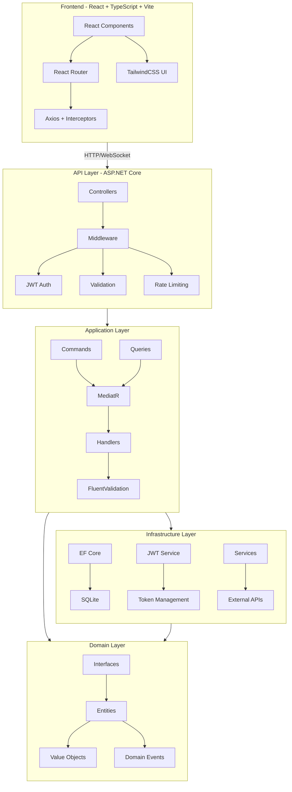
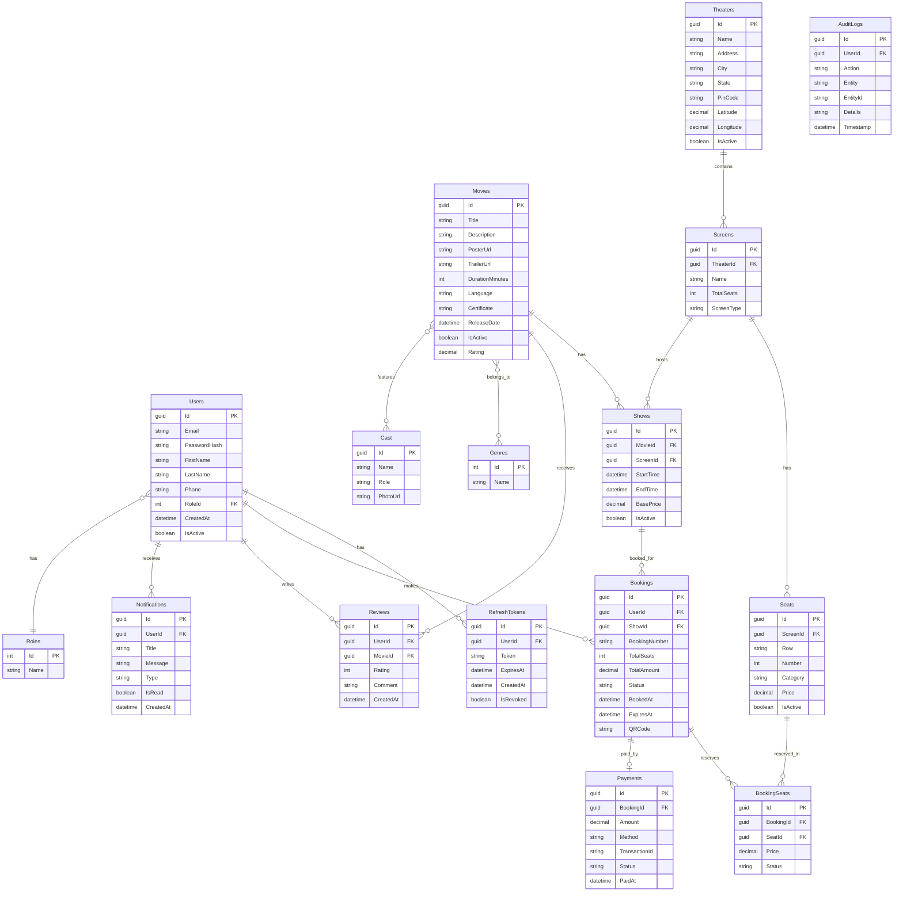

# ShowSphere - Production-Grade Ticket Booking Platform

A complete BookMyShow-style ticket booking platform built with Clean Architecture principles.

## Architecture



## Database Schema



## Features

- **Authentication & Authorization**: JWT + Refresh Tokens, Role-based access (Admin, User)
- **Movie Browsing**: Search, filter by genre/language/city, sort by rating/date
- **Theater Management**: Multiple theaters, screens, seat categories
- **Show Management**: Schedule shows, manage timings
- **Booking Flow**: Seat selection → Lock → Payment → Confirmation
- **Concurrency Safety**: Optimistic concurrency + seat locking with timeout
- **Ticket Generation**: QR code tickets with booking details
- **Reviews & Ratings**: User reviews with aggregated ratings
- **Admin Dashboard**: CRUD for movies, theaters, shows + analytics
- **Notifications**: Booking confirmations, cancellations
- **Real-time Updates**: SignalR for seat availability

## Prerequisites

Before running this project, install the following on your machine:

| # | Software | Version | Download Link | Verify Command |
|---|----------|---------|---------------|----------------|
| 1 | **Node.js** (includes npm) | 18+ | https://nodejs.org/ | `node -v` / `npm -v` |
| 2 | **.NET 8 SDK** | 8.0+ | https://dotnet.microsoft.com/download/dotnet/8.0 | `dotnet --version` |
| 3 | **Git** | Any | https://git-scm.com/downloads | `git --version` |
| 4 | **VS Code** (recommended) | Latest | https://code.visualstudio.com/ | — |

### Recommended VS Code Extensions

| Extension | Purpose |
|-----------|---------|
| C# Dev Kit | .NET/C# IntelliSense and debugging |
| ESLint | JavaScript/TypeScript linting |
| Tailwind CSS IntelliSense | Tailwind class autocomplete |
| SQLite Viewer | Browse SQLite database in VS Code |

> **Note:** No need to install SQLite separately — the .NET SDK handles it via the `Microsoft.Data.Sqlite` NuGet package.

## Quick Start (Copy-Paste Ready)

### Step 1: Clone and Open
```bash
git clone <your-repo-url>
cd ShowSphere
code .
```

### Step 2: Start Backend (Terminal 1)
```bash
cd backend/src/ShowSphere.API
dotnet restore
dotnet run
```
Wait until you see: `ShowSphere API starting on []`

The API runs at **http://localhost:5001** and Swagger UI at **http://localhost:5001/swagger**

### Step 3: Start Frontend (Terminal 2)
```bash
cd frontend
npm install
npm run dev
```
Open **http://localhost:5173** in your browser.

### Step 4: Login
| Role | Email | Password |
|------|-------|----------|
| Admin | admin@showsphere.com | Admin@123 |
| User | user@showsphere.com | User@123 |

## Configuration (Optional)

### Razorpay Payment Gateway
The project uses Razorpay test keys by default. For your own keys, update `backend/src/ShowSphere.API/appsettings.json`:
```json
"Payment": {
  "Razorpay": {
    "KeyId": "your_razorpay_key_id",
    "KeySecret": "your_razorpay_key_secret"
  }
}
```

### Email Notifications (Gmail SMTP)
To enable booking confirmation/cancellation emails:
1. Use a Gmail account with **2-Step Verification** enabled
2. Go to https://myaccount.google.com/apppasswords and generate an App Password
3. Update `appsettings.json`:
```json
"Email": {
  "SmtpHost": "smtp.gmail.com",
  "SmtpPort": 587,
  "SenderEmail": "your-email@gmail.com",
  "SenderPassword": "your-16-char-app-password",
  "SenderName": "ShowSphere"
}
```

### Google OAuth Login
Update both files with your Google Cloud Console Client ID:
- `backend/src/ShowSphere.API/appsettings.json` → `Google:ClientId`
- `frontend/.env` → `VITE_GOOGLE_CLIENT_ID`

## Detailed Installation

### 1. Clone the repository
```bash
git clone <your-repo-url>
cd ShowSphere
```

### 2. Backend Setup
```bash
cd backend
dotnet restore
cd src/ShowSphere.API
dotnet run
```

The API will be available at `http://localhost:5001`.
Swagger docs at `http://localhost:5001/swagger`.

### 3. Frontend Setup
```bash
cd frontend
npm install
npm run dev
```

The frontend will be available at `http://localhost:5173`.

### 4. Seed Data (Automatic)
The application **automatically** seeds sample data on first run including:
- Admin user (admin@showsphere.com / Admin@123)
- Sample user (user@showsphere.com / User@123)
- 10+ movies with genres and cast
- Theaters with screens and seats
- Shows for the next 7 days
- Sample bookings with payment data

> If data looks stale or corrupt, delete `backend/src/ShowSphere.API/showsphere.db` and restart the backend — it will recreate everything fresh.

## Environment Variables

### Backend (appsettings.json)
```json
{
  "Jwt": {
    "Secret": "your-256-bit-secret-key-here-minimum-32-chars",
    "Issuer": "ShowSphere",
    "Audience": "ShowSphere",
    "AccessTokenExpirationMinutes": 15,
    "RefreshTokenExpirationDays": 7
  },
  "ConnectionStrings": {
    "DefaultConnection": "Data Source=showsphere.db"
  }
}
```

### Frontend (.env)
```env
VITE_API_URL=http://localhost:5001/api
VITE_SIGNALR_URL=http://localhost:5001
```

## Running the Application

### Development Mode
```bash
# Terminal 1 - Backend
cd backend/src/ShowSphere.API
dotnet run

# Terminal 2 - Frontend
cd frontend
npm run dev
```

### Production Build
```bash
# Backend
cd backend/src/ShowSphere.API
dotnet publish -c Release -o ./publish

# Frontend
cd frontend
npm run build
```

## API Documentation

Swagger UI is available at `http://localhost:5001/swagger` when running in Development mode.

## Project Structure

```
ShowSphere/
├── backend/
│   ├── ShowSphere.sln
│   └── src/
│       ├── ShowSphere.Domain/          # Entities, Interfaces, Value Objects
│       ├── ShowSphere.Application/     # CQRS, Handlers, DTOs, Validators
│       ├── ShowSphere.Infrastructure/  # EF Core, JWT, Services
│       └── ShowSphere.API/             # Controllers, Middleware, Program.cs
├── frontend/
│   ├── src/
│   │   ├── api/          # Axios client and API services
│   │   ├── components/   # Reusable UI components
│   │   ├── features/     # Feature-based modules
│   │   ├── hooks/        # Custom React hooks
│   │   ├── lib/          # Utilities and helpers
│   │   ├── pages/        # Page components
│   │   ├── routes/       # Route definitions
│   │   ├── store/        # State management
│   │   └── types/        # TypeScript type definitions
│   └── package.json
├── docs/                  # Additional documentation
└── scripts/              # Utility scripts
```

## Troubleshooting

| Issue | Solution |
|-------|----------|
| `dotnet` not recognized | Install .NET 8 SDK and restart terminal |
| `node` / `npm` not recognized | Install Node.js 18+ and restart terminal |
| Database errors on startup | Delete `showsphere.db` file and restart backend |
| JWT errors | Ensure secret key is at least 32 characters |
| CORS errors | Check that frontend URL is in AllowedOrigins |
| Port 5001 in use | Kill the process: `netstat -ano \| findstr :5001` then `taskkill /PID <pid> /F` |
| Port 5173 in use | Kill the process or change port in `vite.config.ts` |
| `npm install` fails | Delete `node_modules` folder and `package-lock.json`, then re-run `npm install` |
| Emails going to spam | Ensure no emojis in templates; use App Password not regular password |
| Google login not working | Verify Google Client ID in both `appsettings.json` and `frontend/.env` |

## Tech Stack

| Layer | Technology |
|-------|-----------|
| Frontend | React 18, TypeScript, Vite 5, TailwindCSS 3, TanStack React Query |
| Backend | .NET 8, ASP.NET Core, MediatR (CQRS), FluentValidation |
| Database | SQLite + EF Core 8 |
| Auth | JWT (Access + Refresh tokens), Google OAuth |
| Payments | Razorpay (Strategy Pattern - swappable) |
| Emails | Gmail SMTP with HTML templates |
| Real-time | SignalR (seat availability) |
| QR Codes | QRCoder library (PNG generation) |

## Assumptions & Design Decisions

1. **SQLite for portability** - No external DB server needed; just copy the project
2. **Seat locking timeout**: 10 minutes - seats auto-release after timeout
3. **Razorpay test mode** - Uses test keys; switch to live keys for production
4. **QR Code** - Generated as PNG base64 using QRCoder library, embedded in confirmation emails
5. **SignalR** - Used for real-time seat availability during booking
6. **Rate limiting** - 10 requests/minute on auth endpoints
7. **Refresh token rotation** - Old token invalidated on refresh
8. **Email delivery** - Uses Gmail SMTP with App Password; skips silently if not configured
