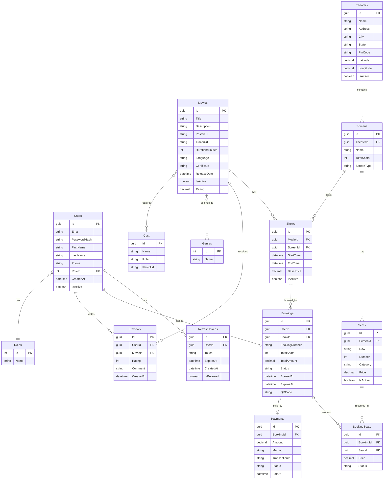

# ShowSphere — Full-Stack Cinema Booking Platform

A production-ready BookMyShow-inspired ticket booking platform built with **.NET 8 Clean Architecture**, **React 18 + TypeScript**, and **PostgreSQL on Neon**. Features real-time seat locking via SignalR, Razorpay payments, HMAC-signed QR ticket generation, Google OAuth, JWT auth with refresh tokens, strong password validation, lazy booking expiry, and a full admin panel.

## Tech Stack

| Layer | Technology |
|-------|-----------|
| Frontend | React 18, TypeScript, Vite, TailwindCSS, TanStack Query v5, React Hook Form, Zod |
| Backend | .NET 8, ASP.NET Core, Clean Architecture, MediatR (CQRS), FluentValidation |
| Database | PostgreSQL (Neon cloud) + EF Core 8 + Npgsql 8 |
| Auth | JWT (Access + Refresh tokens), Google OAuth, Role-based (Admin / User) |
| Payments | Razorpay |
| Emails | Gmail SMTP with App Password |
| Real-time | SignalR (live seat availability) |
| QR Codes | HMAC-signed QR ticket generation + html5-qrcode scanner |
| Logging | Serilog (console + rolling file) |
| Secrets | DotNetEnv (`.env` file, gitignored) |
| Deployment | Docker on Render (backend) + Vercel (frontend) |

---

## Architecture

```
ShowSphere/
├── backend/
│   ├── Dockerfile                          # Multi-stage Docker build for Render
│   ├── ShowSphere.sln
│   └── src/
│       ├── ShowSphere.Domain/              # Entities, Enums, Interfaces
│       ├── ShowSphere.Application/         # CQRS Commands/Queries, Handlers, Validators, DTOs
│       ├── ShowSphere.Infrastructure/      # EF Core, Migrations, JWT, Email, Payment services
│       └── ShowSphere.API/                 # Controllers, Middleware, Hubs, Program.cs
└── frontend/
    └── src/
        ├── api/          # Axios client + API service functions
        ├── components/   # Reusable UI components (Navbar, MovieCard, Layout, etc.)
        ├── pages/        # All page components
        ├── routes/       # Protected route wrapper
        ├── store/        # Auth + Theme context
        └── types/        # TypeScript type definitions
```

## Database Schema



## Features

### Auth & Users
- JWT access tokens (15 min) + refresh tokens (7 days) with rotation
- Google OAuth login
- Register, Login, Forgot Password, Reset Password via Gmail SMTP
- Strong password validation — 8+ chars, uppercase, lowercase, digit, special character
- Live password checklist UI on Register, Profile, and Reset Password pages
- Role-based access control (Admin / User)

### Movie Browsing
- Movie listing with search and filter by genre, language, city
- Movie detail page with cast, trailer link, reviews, and aggregated rating
- Wishlist (add/remove movies)
- Hero carousel on homepage

### Booking Flow
- Browse shows by movie + city + date
- Real-time seat selection with SignalR locking
- EF Core concurrency tokens to prevent double-booking
- Pending bookings auto-expire (lazy evaluation on GET — no background job needed)
- Booking confirmation page with countdown timer
- QR code ticket generated using HMAC signature
- QR code scanner for ticket verification

### Payments
- Razorpay integration (test mode by default)
- Payment record linked to booking on success

### Admin Panel
- Movie CRUD (create, edit, delete, poster/trailer URLs)
- Show scheduling with overlap detection per screen
- Theater and screen management
- Admin dashboard with platform-wide stats

### Infrastructure
- Global exception middleware with structured error responses
- Serilog structured logging (console + rolling file sink)
- Rate limiting on auth endpoints
- Health check endpoint (`/health`)
- Secrets managed via `.env` with DotNetEnv — never stored in `appsettings.json`

## Prerequisites

Before running this project, install the following on your machine:

| # | Software | Version | Download Link | Verify Command |
|---|----------|---------|---------------|----------------|
| 1 | **Node.js** (includes npm) | 18+ | https://nodejs.org/ | `node -v` / `npm -v` |
| 2 | **.NET 8 SDK** | 8.0+ | https://dotnet.microsoft.com/download/dotnet/8.0 | `dotnet --version` |
| 3 | **Git** | Any | https://git-scm.com/downloads | `git --version` |
| 4 | **VS Code** (recommended) | Latest | https://code.visualstudio.com/ | — |

### Recommended VS Code Extensions

| Extension | Purpose |
|-----------|---------|
| C# Dev Kit | .NET/C# IntelliSense and debugging |
| ESLint | JavaScript/TypeScript linting |
| Tailwind CSS IntelliSense | Tailwind class autocomplete |
| SQLite Viewer | Browse SQLite database in VS Code |

> **Note:** No need to install SQLite separately — the .NET SDK handles it via the `Microsoft.Data.Sqlite` NuGet package.

## Quick Start

### Step 1 — Clone
```bash
git clone https://github.com/YOUR_USERNAME/showsphere.git
cd showsphere
```

### Step 2 — Configure backend secrets
```bash
cd backend/src/ShowSphere.API
copy .env.example .env
```
Fill in your values in `.env` (DB connection string, JWT secret, Razorpay keys, Gmail App Password, etc.).

### Step 3 — Start backend
```bash
dotnet restore
dotnet run
```
API: **http://localhost:5001** | Swagger: **http://localhost:5001/swagger**

### Step 4 — Start frontend
```bash
cd frontend
npm install
npm run dev
```
Frontend: **http://localhost:5173**

### Step 5 — Login
| Role | Email | Password |
|------|-------|----------|
| Admin | admin@showsphere.com | Admin@123 |
| User | user@showsphere.com | User@123 |

## Environment Variables

### Backend — `backend/src/ShowSphere.API/.env`
```env
ConnectionStrings__DefaultConnection=Host=...;Database=neondb;Username=...;Password=...;SSL Mode=Require
Jwt__Secret=YOUR_JWT_SECRET_MIN_32_CHARS
Google__ClientId=YOUR_GOOGLE_CLIENT_ID.apps.googleusercontent.com
Payment__Razorpay__KeyId=rzp_test_XXXX
Payment__Razorpay__KeySecret=YOUR_RAZORPAY_SECRET
Email__SenderEmail=your-email@gmail.com
Email__SenderPassword=your-16-char-app-password
QrCode__Secret=YOUR_QRCODE_HMAC_SECRET
Cors__AllowedOrigins=http://localhost:5173,https://your-app.vercel.app
```
See `.env.example` for all keys with descriptions.

### Frontend — set on Vercel dashboard (or local `.env`)
```env
VITE_API_URL=https://your-backend.onrender.com/api
```

## Seed Data (Automatic)

On first `dotnet run` the app automatically seeds:
- Admin + sample user accounts
- 10+ movies with genres and cast
- Theaters, screens, and seats
- Shows for the next 7 days
- Sample bookings, payments, and reviews

## Deployment

### Backend → Render (Docker)
1. New Web Service → connect GitHub repo
2. Root Directory: `backend` | Environment: `Docker`
3. Add all `.env` keys as environment variables in the Render dashboard
4. Set `Cors__AllowedOrigins` to include your Vercel frontend URL

### Frontend → Vercel
1. Import GitHub repo
2. Root Directory: `frontend` | Build Command: `npm run build` | Output: `dist`
3. Add env var: `VITE_API_URL=https://your-app.onrender.com/api`


## Troubleshooting

| Issue | Solution |
|-------|----------|
| `dotnet` not recognized | Install .NET 8 SDK and restart terminal |
| `node` / `npm` not recognized | Install Node.js 18+ and restart terminal |
| Database errors on startup | Check `.env` connection string and Neon DB status |
| JWT errors | Ensure `Jwt__Secret` is at least 32 characters |
| CORS errors | Add frontend URL to `Cors__AllowedOrigins` in `.env` |
| Port 5001 in use | `netstat -ano \| findstr :5001` then `taskkill /PID <pid> /F` |
| Port 5173 in use | Change port in `vite.config.ts` |
| Google login not working | Verify `Google__ClientId` in `.env` matches Google Console |
| Emails not sending | Use Gmail App Password (not regular password); enable 2FA first |

## Design Decisions

- **PostgreSQL on Neon** — cloud-hosted, free tier, supports `pgvector` for future AI features
- **Lazy booking expiry** — pending bookings expire on GET instead of requiring a background job
- **HMAC-signed QR tickets** — tamper-proof without a separate lookup on every scan
- **Npgsql UTC enforcement** — all `DateTime` values explicitly set to `DateTimeKind.Utc` before EF Core queries
- **DotNetEnv secrets** — `.env` loaded at startup; `appsettings.json` has no real secrets
- **Refresh token rotation** — old token invalidated on every refresh
- **Rate limiting** — applied on auth endpoints to prevent brute force
- **Razorpay test mode** — swap `KeyId`/`KeySecret` in `.env` to go live
